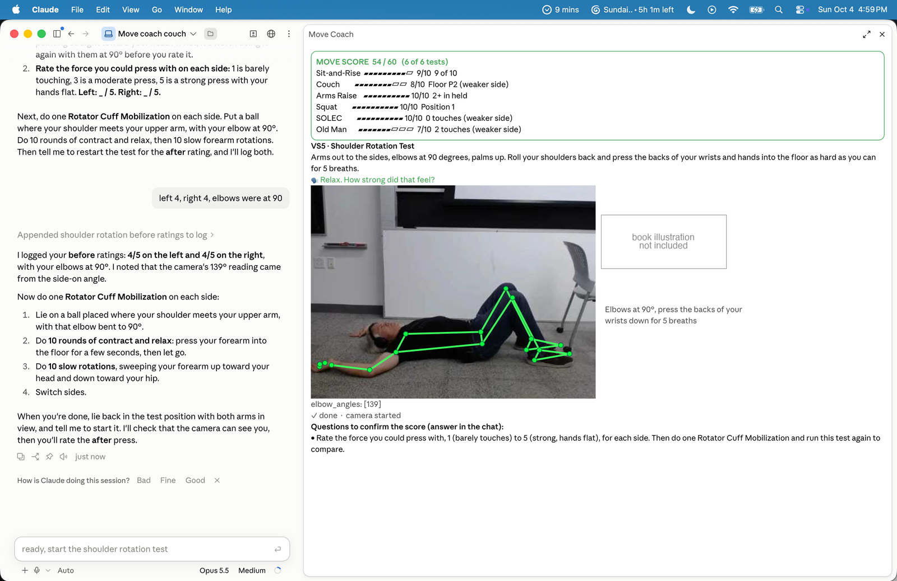
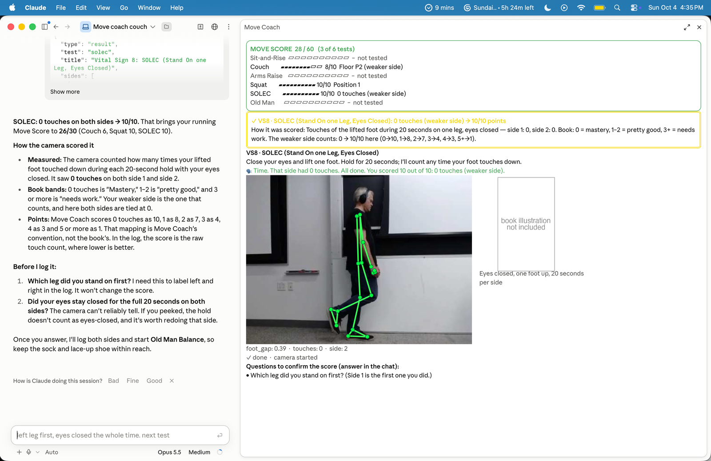
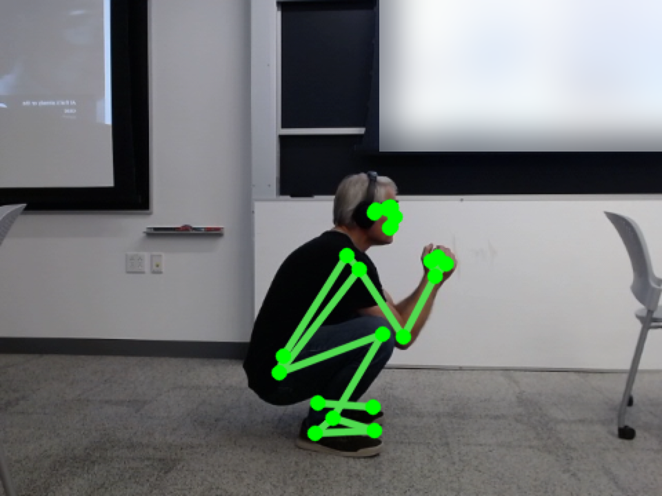
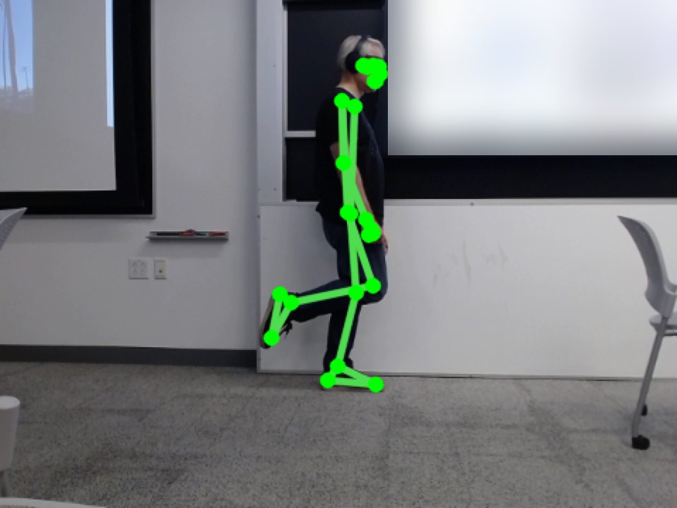
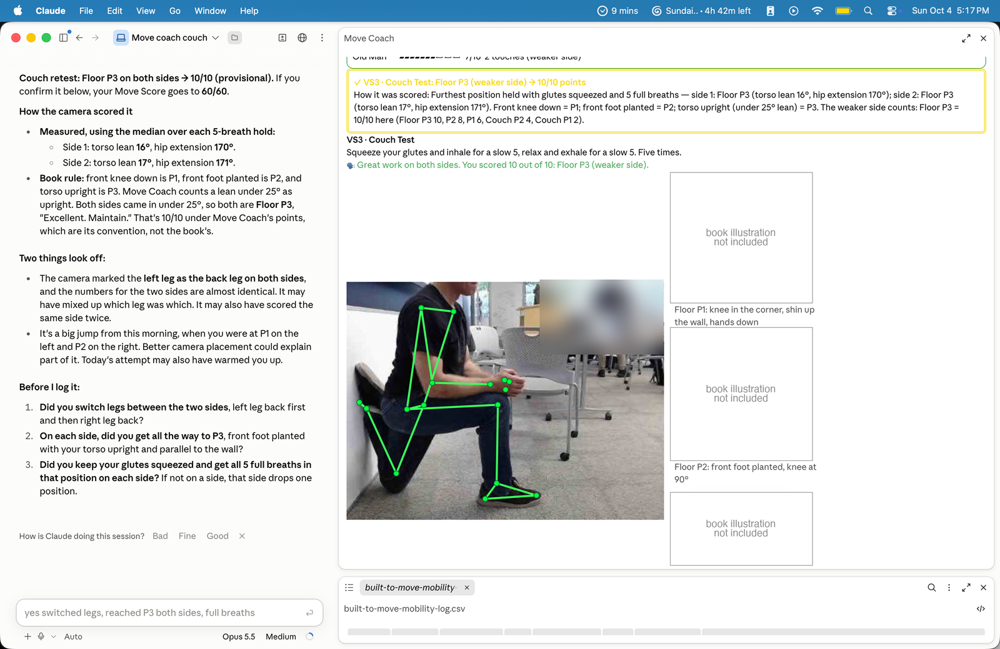
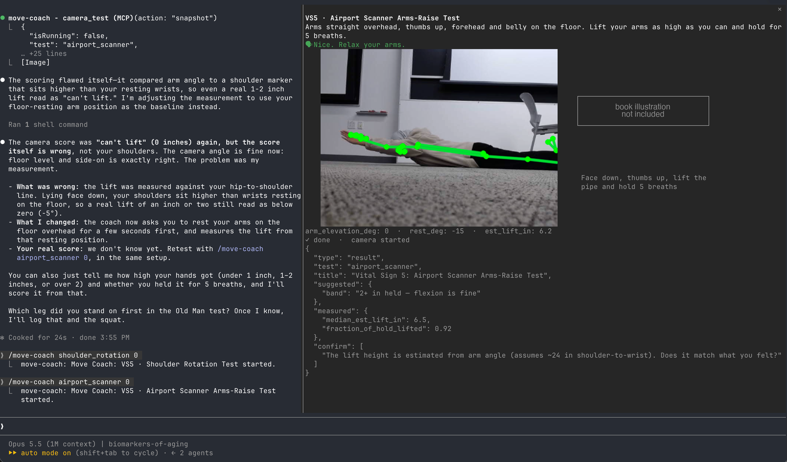

# Move Coach: AI Mobility Vitals

An AI coach that scores the *Built to Move* mobility tests from your camera, coaches you by voice, and can record your brain waves with a Muse headband.

> Mobility is "the harmonious convergence of all the elements that allow you to move freely."
> (Kelly & Juliet Starrett, *Built to Move*)

Most biomarkers of aging need a blood draw, a lab or a wearable. Some of the strongest need only a floor. How easily you can sit down on the floor and stand back up without your hands has been linked to all-cause mortality. Balance on one leg, squat depth and hip extension all decline with age, and all of them can be trained.

Move Coach turns the book's movement self-tests into a guided, camera-scored assessment:

1. You stand in front of your laptop, and a voice coaches you through each test.
2. The camera measures what you do.
3. Claude explains your score, asks about anything the camera couldn't see, and logs the result so you can track it over time.

Built at [Sundai Hack #143: Biomarkers of Aging](https://www.sundai.club/projects/10fe4d59-2cd8-4570-ba25-cd72448f2c97), Boston, October 2026.



*Claude coaches in the chat. The Move Coach pane shows the running Move Score, the live camera with pose landmarks, and the questions Claude will ask to confirm the score.*

## What it does

Seven tests, covering five of the book's Vital Signs, add up to a 60-point **Move Score**:

| Vital Sign | Test | What the camera measures |
|---|---|---|
| VS1 | Sit-and-Rise | Hand and knee touches on the way down and back up |
| VS3 | Couch Test | Torso lean and hip extension angle while you hold each position |
| VS5 | Airport Scanner | How high your arms lift, lying face down, over a 5-breath hold |
| VS5 | Shoulder Rotation | Elbow angle and a timed hold (you rate the effort yourself) |
| VS7 | Squat | Hip depth relative to your knees, knee angle, and whether your heels lift |
| VS8 | SOLEC | Foot touches during 20 s on one leg with your eyes closed |
| VS8 | Old Man Balance | Foot touches while you put on a sock and a shoe standing on one leg |

Each test runs the same way:

1. **The coach talks you through it.** Spoken cues tell you how to set up, when to hold and when to breathe. The test waits until the camera can see you before it starts.
2. **The camera scores it.** MediaPipe pose landmarks are drawn live over your body. The measurements map to the book's bands, for example Squat Position 1 = hip crease well below the knees, feet straight, heels flat.
3. **Claude explains the score and checks it.** It says what was measured, which band that falls in and how the band becomes points. Then it asks what the camera can't know, like "Were your toes pointing straight ahead?" or "Did your foot actually touch down?" If your answer changes the result, Claude corrects the score.
4. **The result is logged** to a CSV under the name of the person taking the test, so the next session can compare against this one.

The confirmation step matters. During testing, the camera counted a near-miss as a foot touch, and it counted a Sit-and-Rise hand touch that never happened. The camera does the measuring, and you have the final say on anything it can't see.



*SOLEC (one leg, eyes closed): the camera counts foot touches, and the yellow box explains how they became points. Claude then asks which leg you stood on first.*

<table>
<tr>
<td width="50%"></td>
<td width="50%"></td>
</tr>
<tr>
<td><em>Squat, Position 1: the landmarks put the hip crease well below the knees, with heels flat.</em></td>
<td><em>Old Man Balance on one leg, wearing the Muse headband for EEG.</em></td>
</tr>
</table>



*Couch Test: Floor P3 on both sides, from the measured torso lean (16°, 17°) and hip extension (170°, 171°). Claude points out what looks off and asks before logging it.*

### Brain waves while you move (optional)

If you wear a Muse EEG headband, Move Coach streams its four sensors into the same pane. Each test result then includes the average power in each brain-wave band (delta, theta, alpha, beta and gamma) during that test.

A resting **baseline** comes first: 30 seconds with your eyes open, then 30 seconds with them closed. It does two things:
- **Checks the sensors:** alpha should rise clearly when your eyes are closed.
- **Gives each test a reference**, so results read like "alpha was 15% above your resting level during SOLEC."

Without a headband, Move Coach works exactly the same. The EEG is an observation layer, not part of the score.

## Install

### 1. Requirements

- **macOS** with a camera: a built-in one, a USB webcam, or an iPhone through Continuity Camera.
- **[Claude Code](https://claude.com/claude-code)**, the desktop app or the CLI.
- **[uv](https://docs.astral.sh/uv/getting-started/installation/)**. The helpers are uv scripts that install their own Python packages, including MediaPipe and OpenCV, the first time they run.

  ```bash
  curl -LsSf https://astral.sh/uv/install.sh | sh
  ```

- **Xcode command-line tools**, used once to build the small "Move Coach Camera" app that holds the camera permission:

  ```bash
  xcode-select --install
  ```

- **Optional:** `ffmpeg`, so you can pick a camera by name (`/move-coach squat iphone`):

  ```bash
  brew install ffmpeg
  ```

### 2. Add the plugin

In Claude Code, run:

```
/plugin marketplace add natea/move-coach
/plugin install move-coach@move-coach
```

Then **restart Claude Code**, so the plugin's tool and pane load.

### 3. First run

Ask Claude:

> run the Built to Move guided assessment

You can also open the camera pane yourself with `/move-coach`. On the first test, macOS asks you to allow camera access for **Move Coach Camera**. Click **Allow**. The first run also downloads the pose model and the Python packages, so it takes a minute.

### 4. Optional: a more natural voice (ElevenLabs)

By default the coach uses the built-in macOS voice, and there's nothing to set up. For a more natural voice:

1. Run `/config` in Claude Code and find **move-coach**.
2. Paste your [ElevenLabs API key](https://elevenlabs.io/app/settings/api-keys) into **ElevenLabs API key**. It's kept in Claude Code's secure storage.
3. Optionally, set **ElevenLabs voice ID**. Blank uses the default voice.

If ElevenLabs fails for a cue, that cue falls back to the macOS voice. Clips are cached in `~/.cache/move-coach/tts`.

### 5. Optional: Muse EEG

1. Install liblsl, which muse-lsl needs:

   ```bash
   brew install labstreaminglayer/tap/lsl
   ```

2. Turn on your Muse until its lights are blinking, and put it on.
3. Type `/move-coach eeg`, or press **Connect Muse EEG** in the pane. To connect a specific headband, use `/move-coach eeg Muse-1A2B`.
4. The first time, macOS asks you to allow Bluetooth for **Move Coach Camera**. Click **Allow**.
5. Check that all four contact dots in the pane are green. If AF7 or AF8 stays grey or red, wipe your forehead and settle the band just above your eyebrows.

Move Coach reads the headband through [muse-lsl](https://github.com/alexandrebarachant/muse-lsl). If you already have `muselsl stream` running, it attaches to that.

## Using it

| You type | What happens |
|---|---|
| *"run the Built to Move guided assessment"* | All seven tests in a row; you only answer the confirm questions |
| *"run the squat test"* | One test |
| *"show my mobility history"* | Latest scores next to the previous and first ones |
| `/move-coach [test] [camera]` | Opens the pane and runs a test, or a camera preview with no test |
| `/move-coach stop` | Stops the current test |
| `/move-coach eeg` / `/move-coach eeg stop` | Connects or disconnects the Muse |

**Camera placement:**
- **Side-on:** Squat, Couch and Airport Scanner.
- **Facing the camera:** Sit-and-Rise, SOLEC and Old Man Balance.
- **Shoulder Rotation:** put the camera at your feet or head, raised about a metre and tilted down, so it sees both arms.

**Where results go:** both logs are written to the folder you run Claude Code in.
- `built-to-move-mobility-log.csv`: one row per test and side, with the raw `score`, the `best` possible score, and `points` out of 10.
- `built-to-move-eeg-log.csv`: band power per test, when a Muse is connected.

## How it's built

Move Coach is a Claude Code plugin, built in a day. Claude is the coach's brain, and the plugin is its eyes, ears and voice.

- **Pose engine** (`helper/pose_coach.py`): OpenCV reads the camera, and MediaPipe Pose Landmarker gives 33 body landmarks per frame. Each test is a small state machine (set up, hold, switch sides, result). It turns landmarks into measurements: joint angles, hip depth in torso-lengths, and foot-to-floor contact.
- **Voice:** ElevenLabs, or the Mac's built-in voice if there's no key. Breathing holds use slower, calmer pacing.
- **The pane** (`hooks/register.tsx`): a live view inside Claude Code with the pose skeleton, the Move Score board, the scoring explanation and the EEG traces. It works in both the desktop app and the terminal.

  

  *The same pane in a terminal, during the Airport Scanner test: the camera frame, the measured lift height and the result Claude receives.*
- **Tool and skill:**
  - The plugin gives Claude a `camera_test` tool to start, stop, check and correct tests.
  - The bundled `built-to-move-mobility-test` skill holds the protocols, the scoring tables and the logging rules, and runs the guided assessment.
- **EEG** (`helper/eeg_stream.py`): the helper reads the Muse through muse-lsl. It works out relative band power every 100 ms and flags poor contact per sensor, as flat or noisy.
- **Camera permission:** the Claude app can't grant a camera to processes it starts. So `helper/launch.sh` builds a tiny "Move Coach Camera" app in `~/Library/Application Support/move-coach/` and runs the helpers inside it.

## Illustrations

The pane can show an illustration of each test next to the camera. The book's illustrations are copyrighted, so they aren't included, and the pane works without them. They're blanked out in the screenshots above for the same reason. To add your own photos or drawings, see [`plugins/move-coach/assets/book/README.md`](plugins/move-coach/assets/book/README.md).

## What's next

- **Trends over time:** charts of each Vital Sign across sessions, with alerts when a band slips.
- **Better measurement:**
  - multi-camera or iPhone setups for the side-on tests
  - foot-contact detection that doesn't mistake a near-miss for a touch
  - checking camera scores against a human rater
- **The other five Vital Signs:** breath-hold, daily steps, food, sitting time and sleep, from wearables and the Health app.
- **EEG experiments:** does alpha rise during the Couch-stretch breathing? Does a calmer brain state go with better balance?
- **Practice mode:** after scoring, coaching through the book's practices (floor sitting, squat hang-outs, balance drills) and retesting on schedule.

## Troubleshooting

- **The camera pane is black or says it can't open the camera:** open System Settings → Privacy & Security → Camera and turn on **Move Coach Camera**. If your laptop lid is closed, use another camera: `/move-coach free 1`.
- **"No Muse found":** turn the headband on until its lights blink, and make sure no other app (such as the Muse app) is connected to it.
- **pylsl can't load liblsl:** run `brew install labstreaminglayer/tap/lsl`.
- **The test won't start:** the coach waits until it can see you. Check the pane's camera view, and step back until the green landmarks cover the parts of your body the test needs.
- **You can't hear the coach:** check which audio output your Mac is using. Cues follow the system output, such as Bluetooth headphones.

## Not medical advice

These are the book's self-screens, not a clinical exam. Results show where you are today, not a diagnosis. Stop at any sharp pain, and stay near a wall for the balance tests.

## License

[MIT](LICENSE). *Built to Move* is by Kelly & Juliet Starrett. This project isn't affiliated with or endorsed by the authors or publisher.
